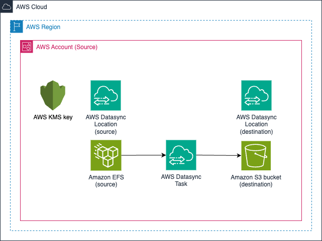

<!-- BEGIN_TF_DOCS -->
# EFS to S3

This example demonstrates how to create an EFS to S3 replication scenario using the AWS DataSync module.

## Requirements

| Name | Version |
|------|---------|
|  [terraform](#requirement\_terraform) | >= 0.14.0 |
|  [aws](#requirement\_aws) | >= 3.72.0 |
|  [awscc](#requirement\_awscc) | >= 0.11.0 |

## Providers

| Name | Version |
|------|---------|
|  [aws](#provider\_aws) | >= 3.72.0 |
|  [random](#provider\_random) | n/a |

## Modules

| Name | Source | Version |
|------|--------|---------|
|  [backup\_tasks](#module\_backup\_tasks) | ../../modules/datasync-task | n/a |
|  [efs\_location](#module\_efs\_location) | ../../modules/datasync-locations | n/a |
|  [s3\_location](#module\_s3\_location) | ../../modules/datasync-locations | n/a |
|  [s3\_log\_delivery\_bucket](#module\_s3\_log\_delivery\_bucket) | terraform-aws-modules/s3-bucket/aws | >=3.5.0 |
|  [source-bucket](#module\_source-bucket) | terraform-aws-modules/s3-bucket/aws | >=3.5.0 |
|  [vpc](#module\_vpc) | terraform-aws-modules/vpc/aws | >=5.0.0 |

## Resources

| Name | Type |
|------|------|
| [aws_efs_file_system.efs](https://registry.terraform.io/providers/hashicorp/aws/latest/docs/resources/efs_file_system) | resource |
| [aws_efs_mount_target.efs_subnet_mount_target](https://registry.terraform.io/providers/hashicorp/aws/latest/docs/resources/efs_mount_target) | resource |
| [aws_kms_key.efs-kms](https://registry.terraform.io/providers/hashicorp/aws/latest/docs/resources/kms_key) | resource |
| [aws_kms_key.source-kms](https://registry.terraform.io/providers/hashicorp/aws/latest/docs/resources/kms_key) | resource |
| [aws_kms_key_policy.efs-kms-key-policy](https://registry.terraform.io/providers/hashicorp/aws/latest/docs/resources/kms_key_policy) | resource |
| [aws_kms_key_policy.source-kms-key-policy](https://registry.terraform.io/providers/hashicorp/aws/latest/docs/resources/kms_key_policy) | resource |
| [aws_s3_bucket_server_side_encryption_configuration.s3-log-bucket](https://registry.terraform.io/providers/hashicorp/aws/latest/docs/resources/s3_bucket_server_side_encryption_configuration) | resource |
| [aws_s3_bucket_server_side_encryption_configuration.source-bucket](https://registry.terraform.io/providers/hashicorp/aws/latest/docs/resources/s3_bucket_server_side_encryption_configuration) | resource |
| [aws_security_group.MyEfsSecurityGroup](https://registry.terraform.io/providers/hashicorp/aws/latest/docs/resources/security_group) | resource |
| [random_pet.prefix](https://registry.terraform.io/providers/hashicorp/random/latest/docs/resources/pet) | resource |
| [aws_availability_zones.available](https://registry.terraform.io/providers/hashicorp/aws/latest/docs/data-sources/availability_zones) | data source |
| [aws_caller_identity.current](https://registry.terraform.io/providers/hashicorp/aws/latest/docs/data-sources/caller_identity) | data source |

## Inputs

| Name | Description | Type | Default | Required |
|------|-------------|------|---------|:--------:|
|  [efs\_security\_group\_egress\_cidr\_block](#input\_efs\_security\_group\_egress\_cidr\_block) | IPv4 CIDR block for egress traffic for EFS and Datasync security group | `string` | `"0.0.0.0/0"` | no |
|  [region](#input\_region) | The AWS region for this deployment | `string` | `"us-east-1"` | no |
|  [subnet-count](#input\_subnet-count) | Number of sunbets per VPC | `number` | `1` | no |
|  [vpc\_cidr\_block](#input\_vpc\_cidr\_block) | VPC CIDR block for the creation of example VPC and subnets | `string` | `"10.0.0.0/16"` | no |

## Outputs

| Name | Description |
|------|-------------|
|  [backup\_tasks](#output\_backup\_tasks) | Datasync Task ARN |
|  [my\_efs\_locations](#output\_my\_efs\_locations) | DataSync EFS Location ARN |
|  [my\_s3\_locations](#output\_my\_s3\_locations) | DataSync S3 Location ARN |
<!-- END_TF_DOCS -->